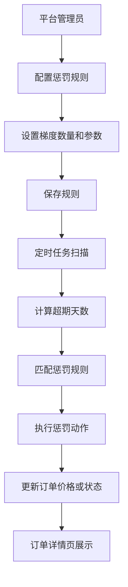
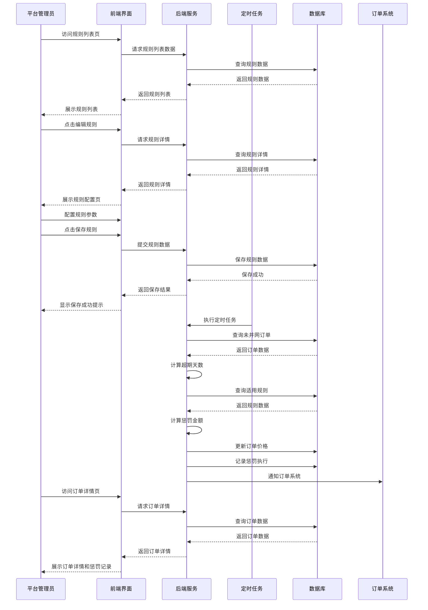

## 1. Product Overview
分布式光伏并网超期惩罚系统，用于管理和执行光伏项目并网超期的惩罚措施。
- 解决光伏项目并网超期问题，通过梯度惩罚机制激励按时并网，提升项目执行效率。
- 目标用户为平台管理员，提供灵活的规则配置和惩罚执行功能。

## 2. Core Features

### 2.1 User Roles
| Role | Registration Method | Core Permissions |
|------|---------------------|------------------|
| 平台管理员 | 系统分配账号 | 配置惩罚规则、查看惩罚执行记录、管理订单 |

### 2.2 Feature Module
1. **规则列表页**：规则展示、启用/禁用、编辑、添加区域、删除
2. **平台配置页**：规则配置、梯度管理、区域设置
3. **订单详情页**：工程款变动履历、惩罚执行记录

### 2.3 Page Details
| Page Name | Module Name | Feature description |
|-----------|-------------|---------------------|
| 规则列表页 | 规则展示 | 展示全国不同地区的惩罚规则，包括规则名称、编号、适用区域、梯度配置、操作时间、操作人等信息 |
| 规则列表页 | 启用/禁用 | 支持通过开关启用或禁用规则，实时更新状态 |
| 规则列表页 | 编辑 | 点击编辑按钮进入规则配置页修改规则详情 |
| 规则列表页 | 添加区域 | 为现有规则添加新的适用区域 |
| 规则列表页 | 删除 | 删除整个规则或删除规则的特定区域配置 |
| 规则列表页 | 折叠/展开 | 支持折叠/展开规则的区域详情 |
| 规则列表页 | 日志 | 查看规则操作日志 |
| 规则列表页 | 分页 | 支持分页显示规则列表，可调整每页显示数量 |
| 平台配置页 | 规则配置 | 配置惩罚规则名称、适用区域、梯度数量等基本信息 |
| 平台配置页 | 梯度管理 | 添加/删除梯度，配置超期天数、间隔天数、惩罚动作、降价金额等 |
| 平台配置页 | 区域设置 | 设置规则适用的省、市、区县，支持三级联动选择 |
| 订单详情页 | 订单基本信息 | 展示订单名称、合同约定并网日期、当前单价等基本信息 |
| 订单详情页 | 工程款变动履历 | 展示超期降价的台账记录，包括触发日期、超期天数、扣减前后单价等 |
| 订单详情页 | 惩罚执行记录 | 记录惩罚执行状态和历史 |

## 3. Core Process
系统核心流程包括规则配置、定时扫描计算、惩罚执行和订单展示四个主要环节。

## 4. User Interface Design
### 4.1 Design Style
- 主色调：#1E40AF（深蓝色）、#3B82F6（蓝色）
- 辅助色：#10B981（绿色，用于成功状态）、#EF4444（红色，用于警告和错误）
- 按钮样式：圆角矩形，有hover效果
- 字体：系统默认字体，标题16-20px，正文14px，说明文字12px
- 布局风格：卡片式布局，顶部导航，左侧菜单
- 图标风格：线性图标，简洁明了

### 4.2 Page Design Overview
| Page Name | Module Name | UI Elements |
|-----------|-------------|-------------|
| 规则列表页 | 规则展示 | 表格展示，包含规则名称、编号、适用区域、梯度配置、操作时间、操作人等列 |
| 规则列表页 | 启用/禁用 | 开关控件，绿色表示启用，灰色表示禁用 |
| 规则列表页 | 操作按钮 | 编辑、添加区域、删除按钮，蓝色文字表示可操作 |
| 规则列表页 | 折叠/展开 | 箭头图标，点击可展开/折叠区域详情 |
| 平台配置页 | 规则配置 | 表单输入框、下拉选择器、保存按钮，区域选择三级联动 |
| 平台配置页 | 梯度管理 | 动态表格，添加/删除按钮，下拉选择器，数字输入框 |
| 平台配置页 | 梯度校验 | 当选择回购动作时，自动移至最后一行并禁用添加梯度按钮 |
| 订单详情页 | 工程款变动履历 | 表格展示，时间戳、数字、状态标签，排序功能 |

### 4.3 Responsiveness
- 设计以桌面端为主，支持1024px以上屏幕
- 响应式布局，在小屏幕设备上自动调整表格显示
- 支持触摸操作，按钮和可点击元素大小适合手指点击

### 4.4 3D Scene Guidance
- 无3D场景需求

## 5. Cross-Functional Swimlane Diagram
