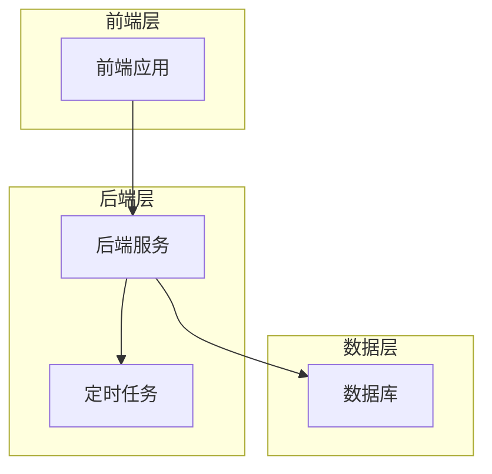
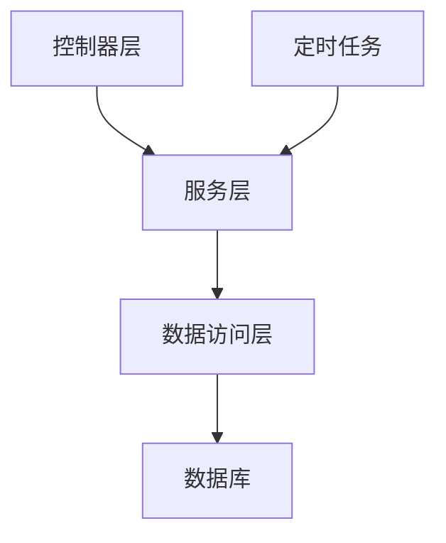
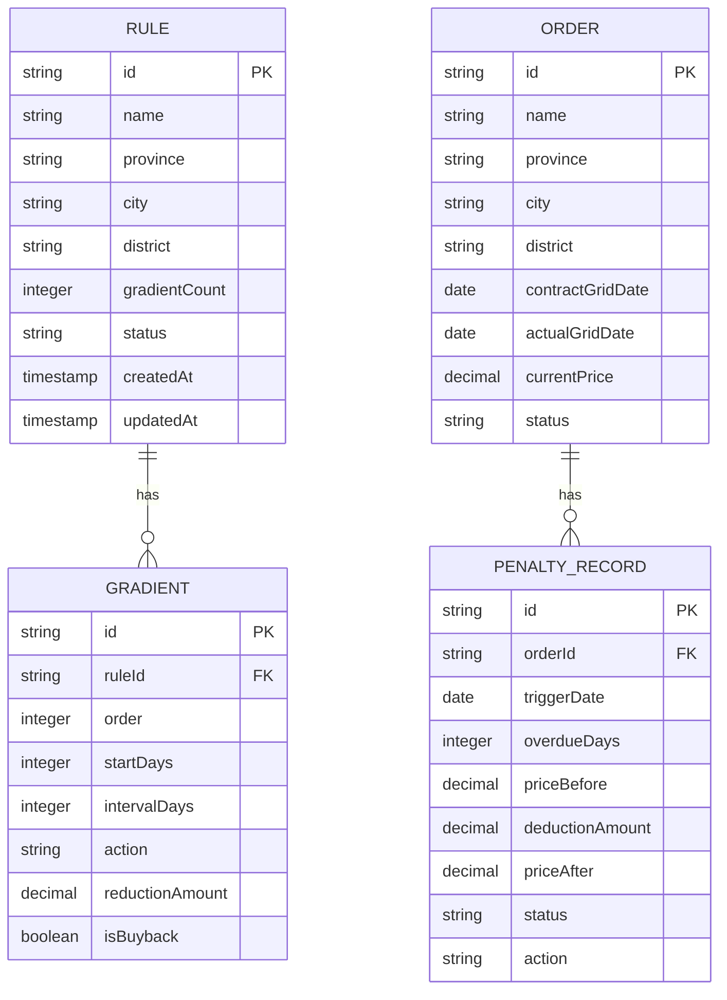

## 1. Architecture Design


## 2. Technology Description
- Frontend: React@18 + tailwindcss@3 + vite
- Initialization Tool: vite-init
- Backend: Express@4
- Database: PostgreSQL

## 3. Route Definitions
| Route | Purpose |
|-------|---------|
| /config | 平台配置页，用于配置惩罚规则 |
| /order/:id | 订单详情页，展示订单信息和工程款变动履历 |

## 4. API Definitions

### 4.1 规则配置相关API

#### GET /api/rules
- 功能：获取所有惩罚规则
- 响应：
```typescript
interface Rule {
  id: string;
  name: string;
  province: string | null;
  city: string | null;
  district: string | null;
  gradientCount: number;
  gradients: Gradient[];
  status: 'enabled' | 'disabled';
  createdAt: string;
  updatedAt: string;
}

interface Gradient {
  id: string;
  ruleId: string;
  order: number;
  startDays: number;
  intervalDays: number;
  action: 'price_reduction' | 'buyback';
  reductionAmount?: number;
  isBuyback: boolean;
}
```

#### POST /api/rules
- 功能：创建新的惩罚规则
- 请求体：
```typescript
interface CreateRuleRequest {
  name: string;
  province: string | null;
  city: string | null;
  district: string | null;
  gradients: Omit<Gradient, 'id' | 'ruleId'>[];
}
```

#### PUT /api/rules/:id
- 功能：更新惩罚规则
- 请求体：同CreateRuleRequest

#### DELETE /api/rules/:id
- 功能：删除惩罚规则

### 4.2 订单相关API

#### GET /api/orders/:id
- 功能：获取订单详情
- 响应：
```typescript
interface Order {
  id: string;
  name: string;
  province: string;
  city: string;
  district: string;
  contractGridDate: string;
  actualGridDate: string | null;
  currentPrice: number;
  status: string;
  penaltyRecords: PenaltyRecord[];
}

interface PenaltyRecord {
  id: string;
  orderId: string;
  triggerDate: string;
  overdueDays: number;
  priceBefore: number;
  deductionAmount: number;
  priceAfter: number;
  status: 'executed' | 'pending';
  action: 'price_reduction' | 'buyback';
}
```

## 5. Server Architecture Diagram


## 6. Data Model

### 6.1 Data Model Definition


### 6.2 Data Definition Language

#### 创建规则表
```sql
CREATE TABLE rules (
    id SERIAL PRIMARY KEY,
    name VARCHAR(255) NOT NULL,
    province VARCHAR(100),
    city VARCHAR(100),
    district VARCHAR(100),
    gradient_count INTEGER NOT NULL CHECK (gradient_count <= 10),
    status VARCHAR(20) NOT NULL DEFAULT 'enabled',
    created_at TIMESTAMP NOT NULL DEFAULT NOW(),
    updated_at TIMESTAMP NOT NULL DEFAULT NOW()
);
```

#### 创建梯度表
```sql
CREATE TABLE gradients (
    id SERIAL PRIMARY KEY,
    rule_id INTEGER NOT NULL REFERENCES rules(id) ON DELETE CASCADE,
    "order" INTEGER NOT NULL,
    start_days INTEGER NOT NULL,
    interval_days INTEGER NOT NULL,
    action VARCHAR(50) NOT NULL CHECK (action IN ('price_reduction', 'buyback')),
    reduction_amount DECIMAL(10, 2),
    is_buyback BOOLEAN NOT NULL DEFAULT FALSE
);
```

#### 创建订单表
```sql
CREATE TABLE orders (
    id SERIAL PRIMARY KEY,
    name VARCHAR(255) NOT NULL,
    province VARCHAR(100) NOT NULL,
    city VARCHAR(100) NOT NULL,
    district VARCHAR(100) NOT NULL,
    contract_grid_date DATE NOT NULL,
    actual_grid_date DATE,
    current_price DECIMAL(10, 2) NOT NULL,
    status VARCHAR(50) NOT NULL
);
```

#### 创建惩罚记录表
```sql
CREATE TABLE penalty_records (
    id SERIAL PRIMARY KEY,
    order_id INTEGER NOT NULL REFERENCES orders(id) ON DELETE CASCADE,
    trigger_date DATE NOT NULL,
    overdue_days INTEGER NOT NULL,
    price_before DECIMAL(10, 2) NOT NULL,
    deduction_amount DECIMAL(10, 2) NOT NULL,
    price_after DECIMAL(10, 2) NOT NULL,
    status VARCHAR(20) NOT NULL CHECK (status IN ('executed', 'pending')),
    action VARCHAR(50) NOT NULL CHECK (action IN ('price_reduction', 'buyback'))
);
```

#### 创建索引
```sql
CREATE INDEX idx_rules_area ON rules(province, city, district);
CREATE INDEX idx_orders_area ON orders(province, city, district);
CREATE INDEX idx_orders_contract_date ON orders(contract_grid_date);
CREATE INDEX idx_penalty_records_order ON penalty_records(order_id);
```